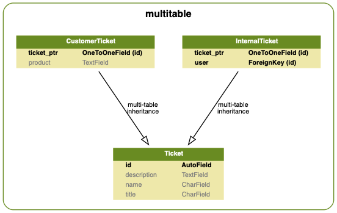

# Django Model Inheritance - Multi-Table Inheritance Example

As described in [the following post](https://godjango.com/blog/django-abstract-base-class-multi-table-inheritance/) Here's what happens when you use Multi Table Inheritance :rocket:

See [multitable/models.py](models.py) for code snippet.

## Model graph

Generated using the awesome [django-extensions](https://github.com/django-extensions/django-extensions), you should really use this :v:

```bash
pip install -r requirements
python manage.py migrate
python manage.py graph_models -a -g -I "*Ticket*" -o result/graph.png
python manage.py graph_models -a -g -I "*Ticket*" -o result/graph.svg
```



## What you get in admin panel

```bash
python manage.py createsuperuser
python manage.py runserver
```
### admin panel


### `CustomerTicket`


### `InternalTicket`


### `Ticket`


# License

MIT © [Gabriel Le Breton](https://gableroux.com)
